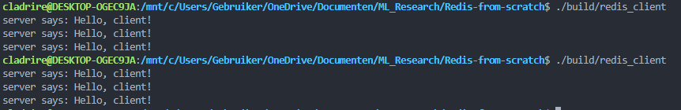
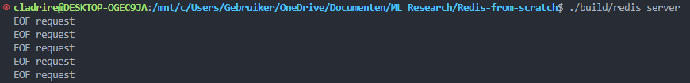

# Redis-from-scratch
Building and understanding Redis from scratch using C/C++.

Current capabilities:
- Create a socket server and client, implemented in `server.cpp` and `client.cpp`.
- Both server and client can communicate bidirectionally (messages are printed out in the terminal).
 
# Building the project
The project is built using CMake, you can build it yourself using the following commands:
```sh
cmake -S . -B ./build
cmake --build ./build
```

Now you should have two executables located in the `build/` directory:
1) `redis_server.exe`: Executed with `./build/redis_server`, this runs the `server` on `0.0.0.0:1234`. The server will read data from the client and write a response for each connection in the queue, afterwards it will close the connection. The server will keep listening to connections in an endless loop.
2) `redis_client.exe`: Executed with `./build/redis_client`, this runs the `client`. The client will: write something, read back from the server, then close the connection.

# Example
When we execute `./build/redis_server`, the server is started and it will listen for any connections. When we execute `./build/redis_client` afterwards, the client will communicate with the server and shut down (the server will keep running and listen for other connections).

`Client`:


`Server`:


