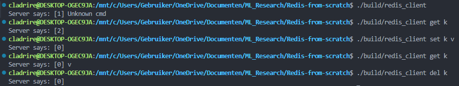

# Redis-from-scratch
Building and understanding Redis from scratch using C/C++.

Current capabilities:
- Create a socket server and client, implemented in `src/server.cpp` and `src/client.cpp`.
- Both server and client can communicate bidirectionally. Client communicates with server through commands, server to client with response codes.
- Server can store data

Supported commands:
- `set key value`: This will save a key-value pair on the server
- `get key`: This will retrieve the value corresponding to the `key` from the server. (If key does not exist server-side, server will respond with `rescode`: \[2\])
- `del key`: This will delete the key-value pair from server-side.

`Rescodes`:
- \[0\]: `RES_OK`, request was handled without issues.
- \[1\]: `RES_ERR`, there was an error during the handling of the request (e.g.: Unknown command). 
- \[2\]: `RES_NX`, key mentioned in request not found server-side.
 
# Building the project
The project is built using CMake, you can build it yourself using the following commands:
```sh
cmake -S . -B ./build
cmake --build ./build
```

Now you should have two executables located in the `build/` directory:
1) `redis_server.exe`: Executed with `./build/redis_server`, this runs the `server` on `0.0.0.0:1234`. The server will read data from the client and write a response for each connection in the queue, afterwards it will close the connection. The server will keep listening to connections in an endless loop.
2) `redis_client.exe`: Executed with `./build/redis_client`, this runs the `client`. The client can: write request, read answer from the server, then close the connection (or send another request).

# Example
When we execute `./build/redis_server`, the server is started and it will listen for any connections. When we execute `./build/redis_client` afterwards, we can execute commands to the server.

`Client`:


`Server`:


We can see that after each client connection (when all client requests are already handled by the server), the server currently detects an EOF error when trying to check the next request header. This is because this next request does not exist. After the error is detected, the server breaks the client connection. Finally, the server will either accept the next client connection in queue or wait for another client connection if the queue is empty.

# Todo
- Fix EOF request error in server after each request
- Make rescodes more readible when printed on client
- Use epoll instead of poll in the event loop. Should be better.
- In `try_one_request` function in `server.cpp` make `memmove` use more efficient.

